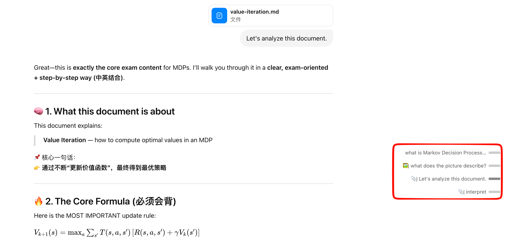
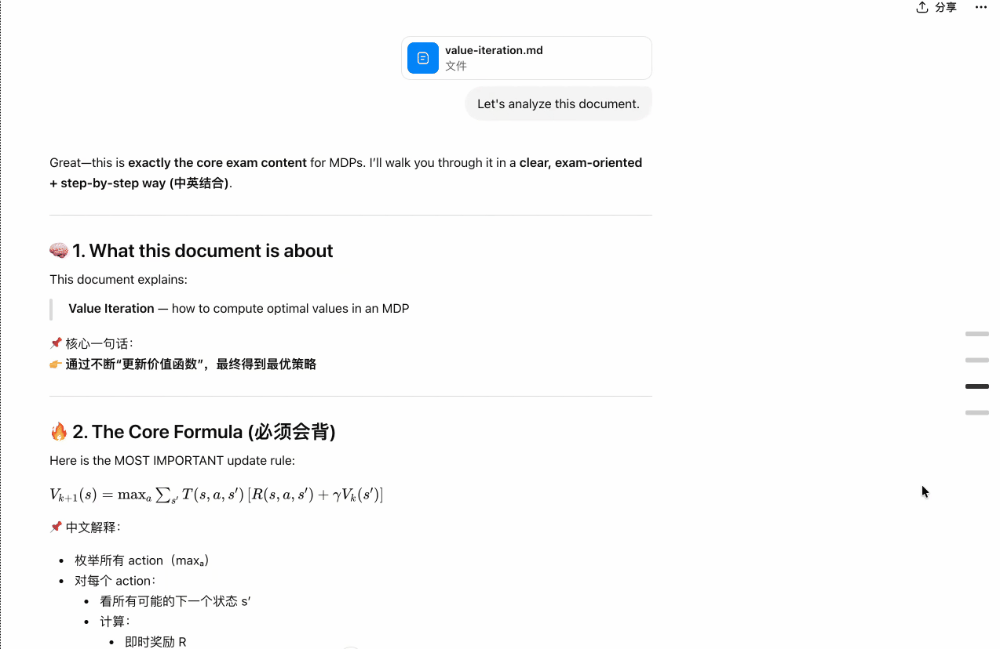
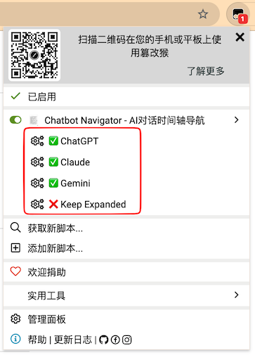

# Chatbot Navigator

[English](README_EN.md)

> 为 ChatGPT / Claude / Gemini 网页添加右侧时间轴导航条，快速跳转长对话中的任意消息。

---

## 功能亮点

- **可视化时间轴** — 页面右侧固定显示小方块，每个方块对应一条用户消息
- **一键跳转** — 点击方块，平滑滚动到对应消息
- **悬浮预览** — 鼠标悬停时展示消息文字摘要，支持智能截断（中英文混排友好）
- **附件识别** — 📎 文件消息、🖼 图片消息自动标注
- **实时更新** — 发送新消息后时间轴自动刷新
- **SPA 路由感知** — 切换对话时时间轴自动重建，无需手动刷新
- **多平台支持** — 一个脚本，三个平台，通过 Tampermonkey 菜单自由开关

## 附件识别逻辑

时间轴标签会根据消息内容自动添加前缀图标：

| 消息内容 | 标签显示 | 示例 |
|----------|---------|------|
| 纯文字 | 截断后的文字 | `我想了解一下...` |
| 文字 + 文件 | 📎\| 文字 | `📎\| 帮我分析这份...` |
| 文字 + 图片 | 🖼\| 文字 | `🖼\| 这张图描述了...` |
| 文字 + 文件 + 图片 | 📎\| 文字 | `📎\| 帮我分析...` |
| 仅文件（无文字） | 📎 文件名 | `📎 report.pdf` |
| 仅图片（无文字） | 🖼 | `🖼` |
| 无内容 | 序号 | `#3` |

> 判断优先级：文件 > 图片。当消息同时包含文字和附件时，图标作为前缀显示在文字摘要之前。

## 展示

## 支持平台

| 平台 | 默认状态 |
|------|---------|
| ChatGPT (`chatgpt.com`) | ✅ 启用 |
| Claude (`claude.ai`) | ✅ 启用 |
| Gemini (`gemini.google.com`) | ✅ 启用 |

---

## 使用方法

1. 打开 ChatGPT / Claude / Gemini 任意一个对话页面
2. 页面右侧会自动出现时间轴导航条
3. **点击方块** → 跳转到对应消息
4. **悬停方块** → 查看消息预览文字

### 自定义开关

通过 Tampermonkey 扩展图标的菜单切换各平台的启用状态和是否保持导航条的展开状态：

> Tampermonkey 图标 → 脚本菜单 → 点击对应选项切换 ✅ / ❌

设置会自动保存，刷新页面后生效。

---

## 安装

### 前置条件

安装以下任一用户脚本管理器浏览器扩展：

- [Tampermonkey](https://www.tampermonkey.net/)（推荐）
- [Violentmonkey](https://violentmonkey.github.io/)

### 方式一：从 Greasy Fork 安装（推荐）

<!-- 上传 Greasy Fork 后将下面的链接替换为实际地址 -->
1. 访问 [Greasy Fork 脚本页面](YOUR_GREASY_FORK_URL)
2. 点击 **安装此脚本**
3. 在弹出的确认页面点击 **安装**

### 方式二：从 GitHub 手动安装

1. 打开 [chatgpt-timeline.user.js](https://github.com/CUBWB7/chatbot-navigator/raw/main/chatgpt-timeline.user.js)
2. Tampermonkey 会自动识别并弹出安装页面
3. 点击 **安装**

---

## 许可证

[MIT License](LICENSE)

## 更强大的相关项目

- [gemini-voyager](https://github.com/nicq000/gemini-voyager)
- [chatgpt-conversation-timeline](https://github.com/Reborn14/chatgpt-conversation-timeline)
- [claude-nexus](https://github.com/Qiuner/claude-nexus)